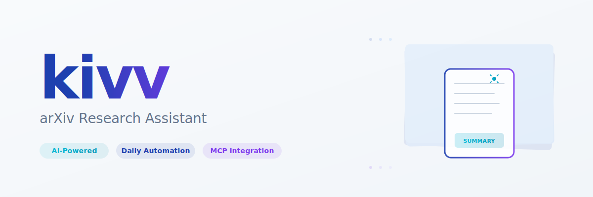

<picture>
  <source media="(prefers-color-scheme: dark)" srcset="assets/hero-dark.svg">
  <source media="(prefers-color-scheme: light)" srcset="assets/hero.svg">
  
</picture>

Automated arXiv research paper discovery and AI-powered summarization system with MCP (Model Context Protocol) integration for Claude Desktop. Built as a vibe-coding project, we keep the tooling lightweight and the feedback loop fast so you can stay in flow while shipping research insights.

## Features

- **Daily Automation**: Automatically searches arXiv for papers matching your topics
- **AI Summaries**: Claude-powered intelligent paper summarization with cost optimization
- **Multi-User**: Support for multiple users with independent topic configurations
- **MCP Integration**: Direct integration with Claude Desktop via Model Context Protocol
- **RSS Feeds**: Per-user RSS/Atom feeds for any feed reader
- **Web Dashboard**: Optional SvelteKit dashboard (coming soon)
- **Cost-Effective**: Runs mostly on Cloudflare free tier (~$3/month for 2 users)

## Architecture

- **MCP Server**: TypeScript Worker handling MCP protocol and tool execution
- **Daily Automation**: Cron-triggered Worker for paper collection and summarization
- **Storage**: Cloudflare D1 (SQLite), R2 (PDFs), KV (cache)
- **AI**: Claude 3.5 Sonnet with Haiku triage for cost optimization

## Quick Start

### Prerequisites

- Cloudflare account with Workers, D1, KV, and R2 enabled
- Anthropic Claude API key ([console.anthropic.com](https://console.anthropic.com))
- **Bun 1.1+** (package manager - install from [bun.sh](https://bun.sh))
- Wrangler CLI (installed automatically via bun)

### Installation

```bash
# Clone the repository
git clone https://github.com/jeffaf/kivv.git
cd kivv

# Install dependencies with bun (our vibe-coding default)
bun install

# Set up environment variables
cp .env.example .env
# Edit .env with your API keys and Cloudflare credentials
```

### Deployment

For complete deployment instructions, see **[DEPLOYMENT.md](DEPLOYMENT.md)**.

Quick deployment:

```bash
# Set secrets for automation worker
cd automation
wrangler secret put CLAUDE_API_KEY
wrangler secret put CRON_SECRET

# Deploy automation worker
wrangler deploy

# Deploy MCP server
cd ../mcp-server
wrangler deploy

# Configure Claude Desktop (see DEPLOYMENT.md for details)
# Add MCP server URL and API key to Claude Desktop config
```

### Verification

```bash
# Test automation worker
curl https://kivv-automation.<username>.workers.dev/health

# Test MCP server
curl https://kivv-mcp.<username>.workers.dev/health

# Check database
wrangler d1 execute kivv-db --command "SELECT COUNT(*) FROM users"

# Or use the automated health check script
./scripts/health-check.sh
```

See [TROUBLESHOOTING.md](TROUBLESHOOTING.md) if you encounter any issues.

### Automated Deployment Script

For one-command deployment:

```bash
# Run the automated deployment script
./scripts/deploy.sh

# This will:
# - Verify prerequisites
# - Check infrastructure
# - Configure secrets
# - Deploy both workers
# - Provide Claude Desktop config
```

## Project Structure

```
kivv/
├── mcp-server/          # MCP Server Worker (Claude integration)
├── automation/          # Daily automation Worker (cron)
├── shared/              # Shared types and utilities
├── tests/
│   ├── security/       # Security tests (auth, injection, XSS)
│   ├── integration/    # MCP tool integration tests
│   └── unit/           # Unit tests
├── .checkpoint/         # Development checkpoints
└── package.json         # Monorepo root with workspaces
```

## Documentation

- [Deployment Guide](DEPLOYMENT.md) - Complete production deployment instructions
- [Troubleshooting Guide](TROUBLESHOOTING.md) - Common issues and solutions
- [Setup Checklist](SETUP-CHECKLIST.md) - Infrastructure setup
- [Implementation Plan](IMPLEMENTATION-PLAN.md) - Chunked development guide
- [API Documentation](docs/api.md) - API endpoints and usage
- [PRD (Full Spec)](docs/kivv-prd-final.md) - Complete technical specification

## CI & Automation

- **Tests & Type Checks**: GitHub Actions run `bun run type-check` and `bun test` on pushes and pull requests to keep the vibe coding fast without breaking the build.
- **Deployments**: Cloudflare Workers deploy pipelines trigger when `mcp-server/` or `automation/` change, using `wrangler` with your configured Cloudflare credentials.

## Development

```bash
# Run type checking
bun run type-check

# Run all tests
bun test

# Run security tests specifically
bun run test:security

# Run tests in watch mode
bun run test:watch

# Run MCP server locally
bun run dev:mcp

# Run automation worker locally
bun run dev:automation

# Build all workspaces
bun run build
```

## Testing

The project includes comprehensive test coverage:

- **Security Tests** (100% coverage required):
  - Authentication (API key validation)
  - Authorization (user data isolation)
  - SQL injection prevention
  - XSS prevention in RSS feeds
  - Rate limiting enforcement

- **Integration Tests**: End-to-end MCP tool workflows
- **Unit Tests**: Isolated utility function testing

```bash
# Run with coverage report
bun run test:coverage
```

## License

MIT
